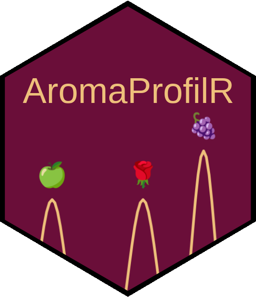

# AromaProfilR 

> AromaProfilR can be accessed online via http://aromaprofilr.spo.inrae.fr/ with its latest knowledge base.

## Presentation

AromaProfilR is an R-Shiny application used to reprocess chromatographic data from GC-MS analyses. This tool allows to double-identify compounds using their match factor, obtained during mass spectrometry, and their Linear Retention Indices (LRI), obtained during gas chromatography. AromaProfilR is tailor-made for untargeted GC-MS analyses and aromatic profiles, especially those of wine, enological matrices, and baker's sourdough. It takes as input files from MassHunter.

The main functions of AromaProfilR are:

* Classify compounds depending on their LRI difference
* Quickly identify aromatic compounds
* Validate experimental replicates i.e. how homogenous the replicates are

AromaProfilR relies on a knowledge base, which contains more than 1000 compounds found in fermented food products. For each compound in the knowledge base, it contains their reference LRI values as well as organoleptic descriptors (taste and odor) from several databases (TheGoodScentsCompany, Flavornet, PubChem).
Each compound identified by MassHunter will be individually classified. First, the LRI difference is calculated using the compound's experimental and reference LRI values. This value is then compared to a threshold entered by the user. Depending on the comparison, AromaProfilR will classify compounds into groups. These groups are indicative of whether the compounds are reliable or not.

### Features

* Reprocess your data to double-identify compounds using their LRI and quickly identify aromatic compounds
* Generate reports as PDF and XLSX 
* Register compounds absent from the knowledge base
* Edit the knowledge base to enrich it
* Authentication through credentials

## How to install

You can access AromaProfilR [online](http://aromaprofilr.spo.inrae.fr/), but also install it on your server or locally.

### On your server using Docker

* Docker version version 27.0.3
* Docker Compose version v2.24.5

1. Clone the project.
2. Change to the cloned directory named `AromaProfilR`, and create a `.Renviron` file that contains this:

```
DB_PASSPHRASE=mypassphrase
ADMIN_ID=myadmin
ADMIN_PASSWORD=mypassword
ADMIN1_MAIL=admin1@mail.com
ADMIN2_MAIL=admin2@mail.com
ADMIN3_MAIL=admin3@mail.com
```

3. In the same directory, type `make install`.
4. Head to [127.0.0.1:3838](http://127.0.0.1:3838/) to access the tool.

### Locally

AromaProfilR only works on Unix-like systems


